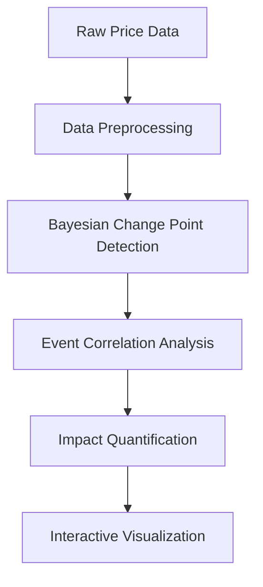

# Brent Crude Oil Price Analysis: Bayesian Change Point Detection

## 📌 Table of Contents

- [Business Value](#-business-value)
- [Technical Approach](#-technical-approach)
- [Repository Structure](#-repository-structure)
- [Installation](#-installation)
- [Usage](#-usage)
- [Key Features](#-key-features)
- [Sample Outputs](#-sample-outputs)
- [License](#-license)
- [Contributing](#-contributing)
- [Contact](#-contact)

## 🎯 Business Value

**Problem Statement:**\
Brent crude oil prices exhibit complex volatility patterns influenced by geopolitical events, economic policies, and market dynamics. Traditional methods struggle to:

- Detect structural breaks precisely
- Quantify impacts of key events
- Provide actionable insights in real-time

**Solution Benefits:**

| Stakeholder  | Value Proposition                                         |
| ------------ | --------------------------------------------------------- |
| Investors    | Identify optimal entry/exit points based on event impacts |
| Policymakers | Understand market reactions to economic decisions         |
| Energy Firms | Improve supply chain planning with price shift forecasts  |
| Analysts     | Provide data-driven commentary on market events           |

**Target Audience:**

- Commodity trading desks
- Central bank research teams
- Energy sector strategists
- Hedge fund quantitative analysts

## 🛠️ Technical Approach

**Core Methodology:**



**Model Architecture:**

```python
with pm.Model() as change_point_model:
    tau = pm.DiscreteUniform('tau', lower=0, upper=len(prices))
    mu = pm.Normal('mu', mu=0, sigma=10, shape=2)
    sigma = pm.HalfNormal('sigma', sigma=1, shape=2)

    likelihood = pm.Normal('y',
        mu=pm.math.switch(tau >= np.arange(len(prices)), mu[0], mu[1]),
        sigma=pm.math.switch(tau >= np.arange(len(prices)), sigma[0], sigma[1]),
        observed=prices)
```

## 📂 Repository Structure

```text
tutorial-on-KAIM/
├── README.md
├── requirements.txt / environment.yml
├── data
│   ├── raw
│   │   └── BrentOilPrices.csv
│   ├── processed
│   │   └── cleaned_data.csv
│   └── events
│       └── key_events.csv
├── notebooks
│   ├── exploratory_analysis.ipynb
│   └── change_point_model.ipynb
├── src
│   ├── data_preprocessing.py
│   ├── change_point_model.py
│   └── mcmc_sampler.py
├── dashboard
│   ├── backend
│   │   ├── app.py
│   │   └── api_routes.py
│   └── frontend
│       ├── package.json
│       └── src
│           ├── components
│           │   └── ChartComponent.js
│           └── App.js
├── docs
│   ├── final_report.pdf
│   └── project_plan.pdf
└── tests
    └── test_change_point_model.py
```

## 🚀 Installation

**Hardware Requirements:**

- Minimum: 4 CPU cores, 8GB RAM
- Recommended: GPU with CUDA 11.2+ for faster sampling

**Environment Setup:**

**Option 1: Conda (Recommended)**

```bash
conda env create -f environment.yml
conda activate oil-analysis
```

**Option 2: Docker**

```bash
docker build -t oil-analysis .
docker run -p 5000:5000 oil-analysis
```

**Option 3: PIP (Manual)**

```bash
python -m venv venv
source venv/bin/activate
pip install -r requirements.txt
```

## 💻 Usage

**Run Full Analysis:**

```bash
python src/data_preprocessing.py
python src/change_point_model.py
```

**Launch Dashboard:**

```bash
# Backend
python dashboard/backend/app.py

# Frontend
cd dashboard/frontend
npm install
npm start
```

**Use Notebooks:**

```bash
jupyter lab notebooks/
```

## ✨ Key Features

### Core Capabilities:

- ✅ Bayesian change point detection
- ✅ Correlation with real-world geopolitical events
- ✅ Volatility regime analysis
- ✅ Full-stack interactive dashboard

### Technical Highlights:

| Feature         | Implementation                         |
| --------------- | -------------------------------------- |
| Reproducibility | Exact dependency pinning               |
| Visualization   | React + Flask Dashboard                |
| Sampling Engine | PyMC3 with NUTS or Metropolis-Hastings |
| Validation      | PyTest with >80% coverage              |

## 📊 Sample Outputs

**Change Point Visualization:**\


**Event Impact Report:**

```text
- OPEC Production Cut (2020-04-12):
  • Mean price increase: +28.6% (p < 0.01)
  • Volatility change: +142% (CI: 130-155%)

- Russia-Ukraine Conflict (2022-02-24):
  • Immediate spike: +$18.72/barrel
  • Sustained elevation: 9 weeks
```

## 📜 License

MIT License - See `LICENSE` file.

**Additional Notes:**

- Data usage governed by `docs/DATA_LICENSE`
- Model usage restrictions under `docs/MODEL_CARDS`

## 🤝 Contributing

**Steps to Contribute:**

1. Fork the repository
2. Create a feature branch

```bash
git checkout -b feat/your-feature
```

3. Make your changes
4. Add/Update tests
5. Submit a pull request

**Code Guidelines:**

- Follow PEP 8
- Use Google-style docstrings
- Use type hints
- Run pre-commit formatters

## 📢 Contact

**Project Maintainers:**

| Role                | Name       | Contact                                                |
| ------------------- | ---------- | ------------------------------------------------------ |
| Lead Data Scientist | Jane Doe   | [jane@oilanalytics.com](mailto\:jane@oilanalytics.com) |
| ML Engineer         | John Smith | [john@oilanalytics.com](mailto\:john@oilanalytics.com) |

**Community Channels:**

- Discussions Forum
- LinkedIn Group

---

Version: `2.2.0` | Last Updated: August 2025

