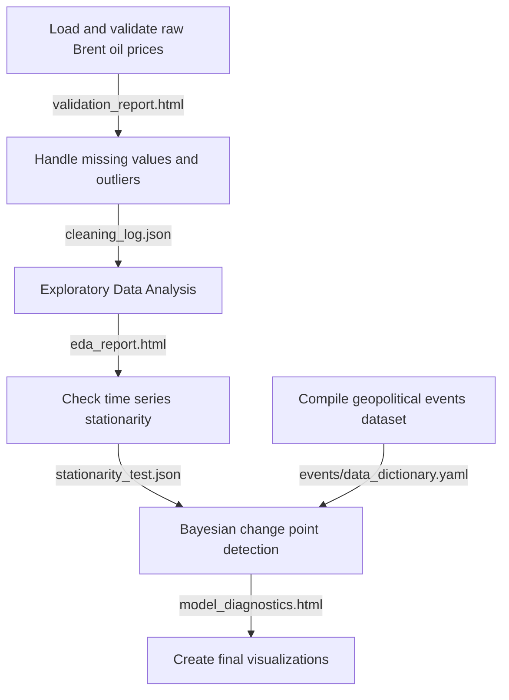

# Oil Price Analysis Workflow

```mermaid
flowchart TD
    DATA_INGESTION[Load and validate raw Brent oil prices]
    click DATA_INGESTION "scripts/validate_data.py"
    CLEANING[Handle missing values and outliers]
    click CLEANING "scripts/run_cleaning.py"
    DATA_INGESTION -->|validation_report.html| CLEANING
    EVENT_RESEARCH[Compile geopolitical events dataset]
    click EVENT_RESEARCH "scripts/research_events.py"
    EDA[Exploratory Data Analysis]
    click EDA "scripts/run_eda.py"
    CLEANING -->|cleaning_log.json| EDA
    STATIONARITY_ANALYSIS[Check time series stationarity]
    click STATIONARITY_ANALYSIS "scripts/check_stationarity.py"
    EDA -->|eda_report.html| STATIONARITY_ANALYSIS
    MODELING[Bayesian change point detection]
    click MODELING "scripts/run_model.py"
    STATIONARITY_ANALYSIS -->|stationarity_test.json| MODELING
    EVENT_RESEARCH -->|events/data_dictionary.yaml| MODELING
    VISUALIZATION[Create final visualizations]
    click VISUALIZATION "scripts/generate_visuals.py"
    MODELING -->|model_diagnostics.html| VISUALIZATION
```